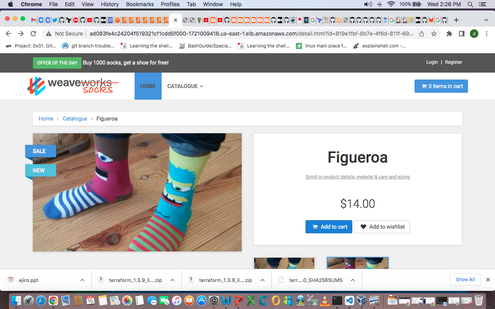
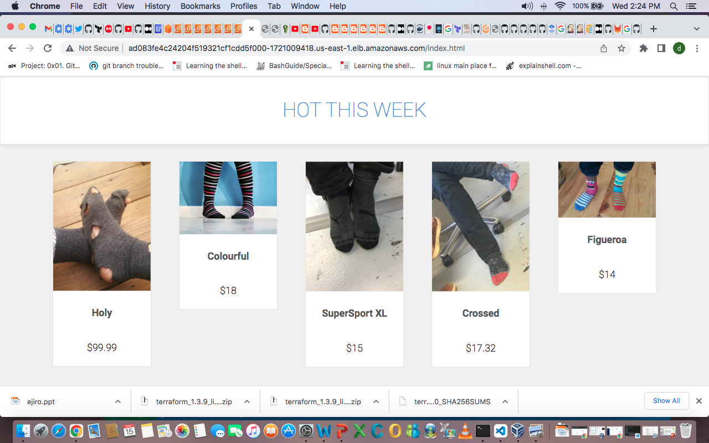
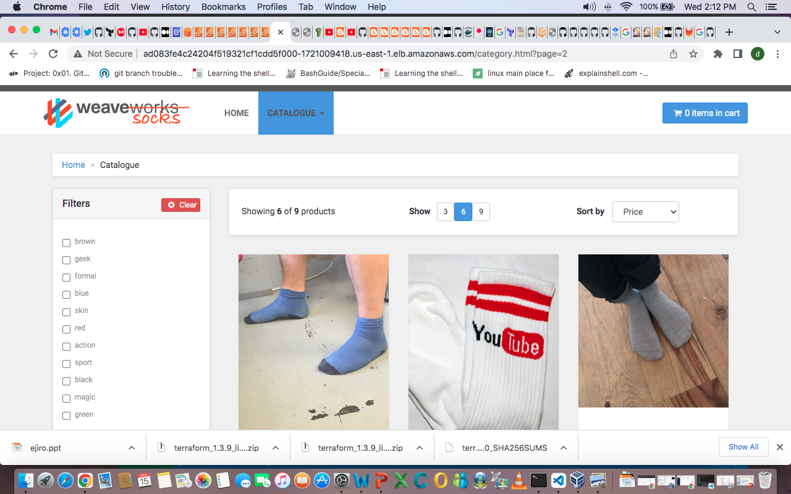
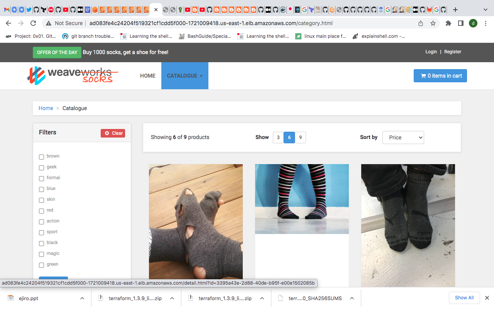
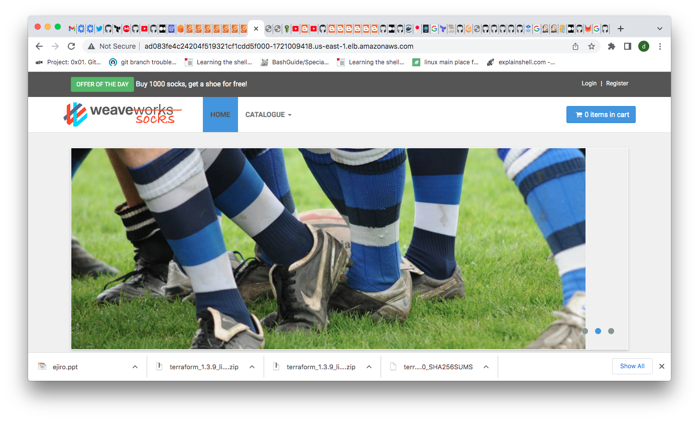
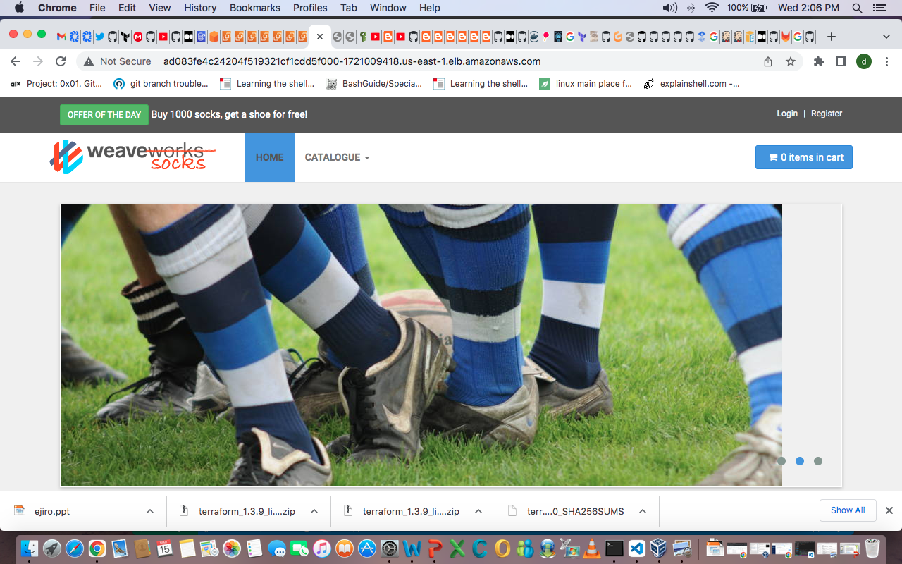
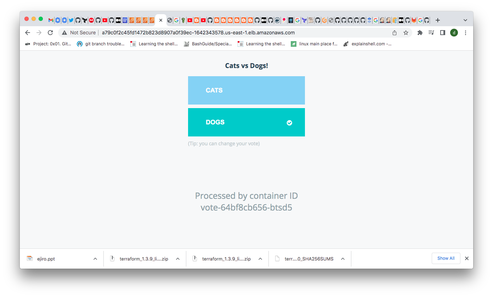
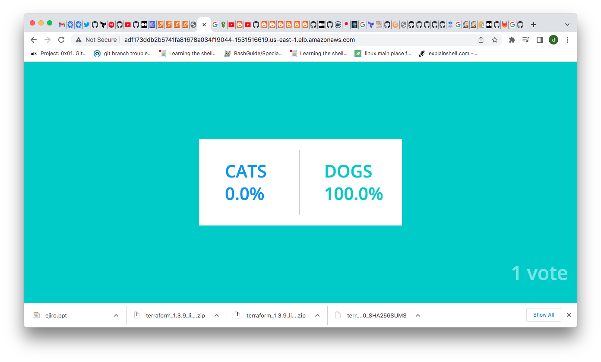

# Deployment Configurations

Sub directories contain scripts and configuration for deployment in target platforms. 

We previously supported other platforms, and you can take a look at them at https://github.com/microservices-demo/user-contribs.
# deploy-sock-shop
  

  
  
  
  

# deploy-vote-app
  
  

